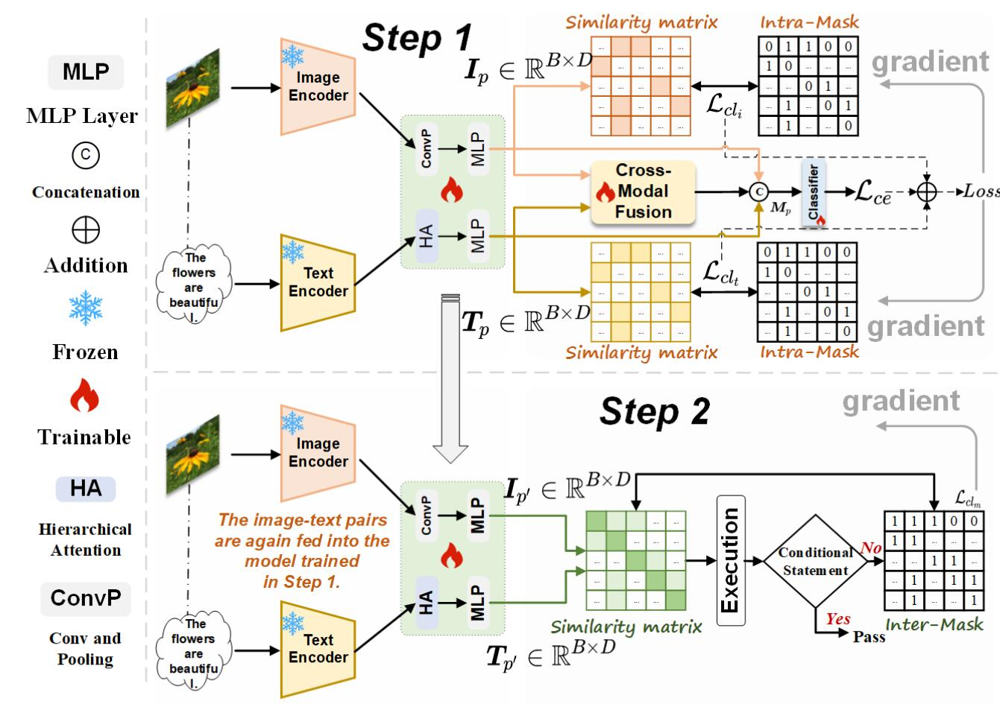
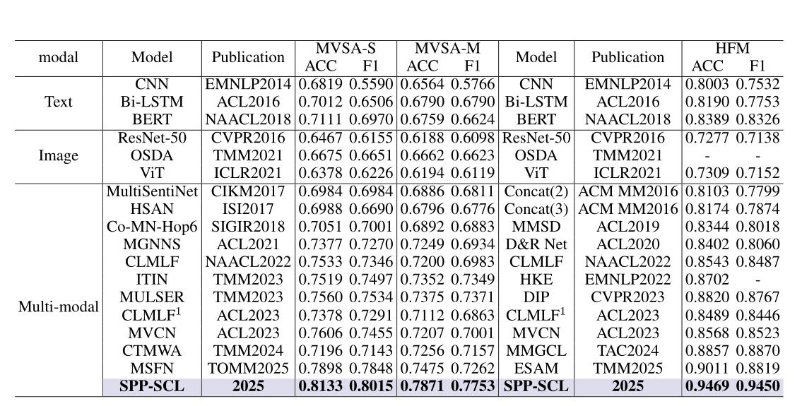
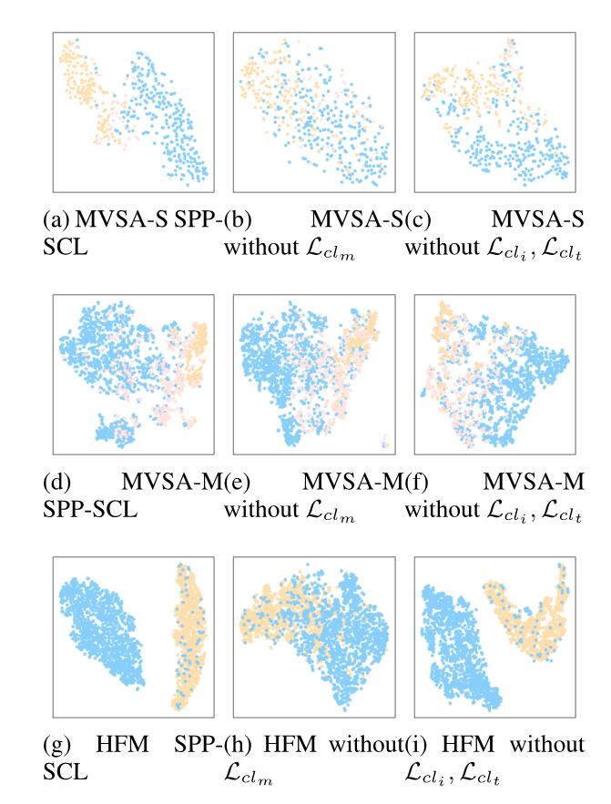

# SPP-SCL: Semi-Push-Pull Supervised Contrastive Learning for Image-Text Sentiment Analysis and Beyond 
### AAAI Conference on Artificial Intelligence (AAAI), 2026

> **Authors:**  
> Jiesheng Wu¹, Shengrong Li² (Corresponding author)
> ¹ School of Computer and Information, Anhui Normal University, Wuhu, China 
> ² College of Artificial Intelligence, Nanjing University of Aeronautics and Astronautics, Nanjing, China

## 1. Preface

- This repository provides codes for "_SPP-SCL: Semi-Push-Pull Supervised Contrastive Learning for Image-Text Sentiment Analysis and Beyond_" AAAI 2026. [Paper](https://arxiv.org/abs/2602.20767) 

## 2. Overview

### 2.1. Introduction

Existing Image-Text Sentiment Analysis (ITSA) methods may suffer from inconsistent intra-modal and inter-modal sentiment relationships. Therefore, we develop a method that balances before fusing to solve the issue of vision-language imbalance intra-modal and inter-modal sentiment relationships; that is, a Semi-Push-Pull Supervised Contrastive Learning (SPP-SCL) method is proposed. Specifically, the method is implemented using a novel two-step strategy, namely first using the proposed intra-modal supervised contrastive learning to pull the relationships between the intra-modal and then performing a well-designed conditional execution statement. If the statement result is false, our method will perform the second step, which is inter-modal supervised contrastive learning to push away the relationships between inter-modal. The two-step strategy will balance the intra-modal and inter-modal relationships to achieve the purpose of relationship consistency and finally perform cross-modal feature fusion for sentiment analysis and detection. Experimental studies on three public image-text sentiment and sarcasm detection datasets demonstrate that SPP-SCL significantly outperforms state-of-the-art methods by a large margin and is more discriminative in sentiment.

### 2.2. Framework Overview

      
    <em> 
    Figure 1:  Overall architecture of SPP-SCL. The framework includes two main steps: intra-modal sentiment alignment via supervised contrastive learning, and conditional inter-modal sentiment alignment.
    </em>

### 2.3. Quantitative Results

      
    <em> 
    Figure 2: Quantitative Results
    </em>

### 2.4. Qualitative Results

      
    <em> 
    Figure 3: Qualitative Results.
    </em>

## 3. Proposed Method

### 3.1. Training/Testing

The training and testing experiments are conducted using [PyTorch](https://github.com/pytorch/pytorch) with an NVIDIA Tesla V100 GPU of 16 GB Memory.

1. Configuring your environment (Prerequisites):
       
    + Installing necessary packages: `pip install -r requirements.txt`.
    + Our training, validation, and testing partitioning follows the [CLMLF](https://github.com/Link-Li/CLMLF/tree/main) partitioning method in NAACL2022 to ensure fair comparison.

1. Downloading necessary data:

    + downloading the datasets and moving them into `./data/`, which can be found from [two MVSA Datasets](http://mcrlab.net/research/mvsa-sentiment-analysis-on-multi-view-social-data/) for MVSA-Single and MVSA-Multiple Datasets. HFM Dataset can be found from [HFM](https://github.com/headacheboy/data-of-multimodal-sarcasm-detection).
Also, these datasets can be downloaded from our [(Baidu Drive)](https://pan.baidu.com/s/1Tmq_jy7E3evUnyz_jGXf2w?pwd=5iew) (extraction code:5iew). 
        
    + downloading our weights and move them into `./save_models/MVSA-S.pth or MVSA-M.pth or HFM.pth`, 
    which can be found from [(Baidu Drive)](https://pan.baidu.com/s/11xNLXA7m0g9SHMAZs-ZFPg?pwd=afr5) (extraction code: afr5). 
    
    + downloading pre-trained ResNet50 and bert-base-uncased weights and move them into `./pre_train/` and `./bert-base-uncased/`,
    which can be found from [Baidu Drive](https://pan.baidu.com/s/1zgYMO2VaShJTrxwwnTN7Ig?pwd=dgp6) (extraction code: dgp6) and [Baidu Drive](https://pan.baidu.com/s/1I5OJkYCoCz5iOuzbnvvVbw) (extraction code: ys4w). 

1. Training Configuration:

    + After you download the dataset, just run `train.py` to train our model.

1. Testing and Evaluating Configuration:

    + After you download all the trained weights, just run `test.py` to perform a prediction.
    + > 📢 **Important Update:** 
	  > **Due to accidental server cleanup, all models were retrained on new hardware. The updated results (see `results.txt`) are even better than those reported in the AAAI 2026 paper.**
    
Note:  If you have difficulty accessing Baidu Drive, please contact us for alternative download links.

## 4. Citation

Please cite our paper if you find the work useful. Thanks!
	
	@misc{wu2026sppsclsemipushpullsupervisedcontrastive,
	      title={SPP-SCL: Semi-Push-Pull Supervised Contrastive Learning for Image-Text Sentiment Analysis and Beyond}, 
	      author={Jiesheng Wu and Shengrong Li},
	      year={2026},
	      eprint={2602.20767},
	      archivePrefix={arXiv},
	      primaryClass={cs.MM},
	      url={https://arxiv.org/abs/2602.20767}, 
	}

## 5. Contact

For any questions, discussions, or collaboration opportunities, please contact:

**Jiesheng Wu**  
School of Computer and Information, Anhui Normal University, Wuhu, China
Email: jasonwu@mail.nankai.edu.cn

**[⬆ back to top](#1-preface)**
